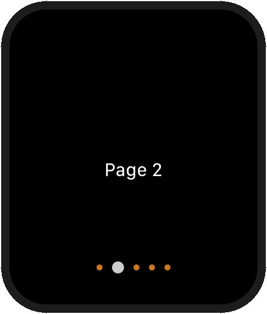

[](https://github.com/antoniokly/HandySwiftUI/blob/master/LICENSE)

# HandySwiftUI

A library of handy SwiftUI components. Keep growing.

## Installation

Add Swift Package Dependency in Xcode, and enter URL ```https://github.com/antoniokly/HandySwiftUI```

```swift
  .package(url: "https://github.com/antoniokly/HandySwiftUI.git", from: "0.0.1")
```

## Usage

```swift
Import HandySwiftUI
```

### Push
```swift
Text("text").push {
  SomeView()
}.foregroundColor(.red)

// is equivalent to

NavigationLink(destination: SomeView()) {
    Text("text").foregroundColor(.red)
}
```

### Platform Specific
```swift
VStack {
  Text("text")
  Text("text1")
}.watchOS { $0
  .font(.system(size: 12, weight: .light))
  .foregroundColor(.blue)
}.iOS { $0
  .font(.system(size: 16, weight: .bold))
}
```

### CustomToggleStyle


```swift
Toggle(isOn: .constant(true)) {
  Text("Text")
}.toggleStyle(CustomToggleStyle(onText: "開", offText: "關", onColor: .red))
```

### PageView


```swift
PageView(pageCount: 5, currentPage: $currentPage, isNavigating: $isNavigating) { index in
    if index == 0 {
        Color.gray.edgesIgnoringSafeArea(.all)
    } else if index == 1 {
        Text("Page 2")
    } else {
        Text("More Page")
    }
}.indicator(currentPageSize: 10, defaultSize: 5, currentPageColor: .accentColor, defaultColor: .orange, opacity: 0.8)
```

## Donation

[](https://www.paypal.com/cgi-bin/webscr?cmd=_s-xclick&hosted_button_id=UXRR2S35YMCQC&source=url)
